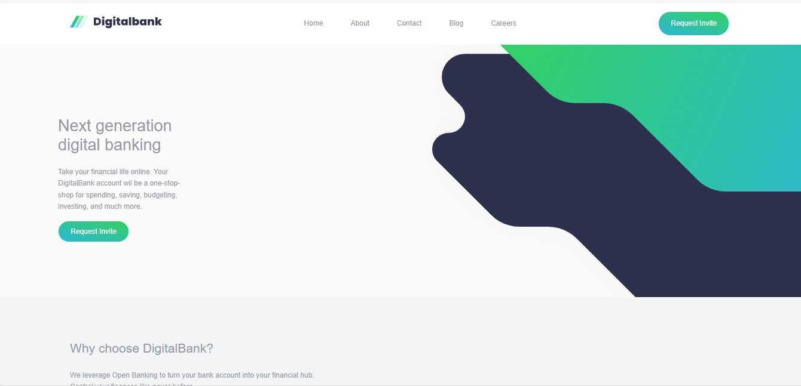

# Frontend Mentor - Digitalbank landing page solution

This is a solution to the [Digitalbank landing page challenge on Frontend Mentor](https://www.frontendmentor.io/challenges/digital-bank-landing-page-WaUhkoDN). Frontend Mentor challenges help you improve your coding skills by building realistic projects.

## Table of contents

- [Overview](#overview)
  - [The challenge](#the-challenge)
  - [Screenshot](#screenshot)
  - [Links](#links)
- [My process](#my-process)
  - [Built with](#built-with)
  - [What I learned](#what-i-learned)
  - [Continued development](#continued-development)
- [Author](#author)
- [Acknowledgments](#acknowledgments)

## Overview

### The challenge

Users should be able to:

- View the optimal layout for the site depending on their device's screen size
- See hover states for all interactive elements on the page

### Screenshot

.

### Links

- Solution URL: [Github repository](https://github.com/timoteaKay/Digitalbank-landing-page.git)
- Live Site URL: [Live Site](https://timoteakay.github.io/Digitalbank-landing-page/)

## My process

It has been a long process. I started this challenge on Tuesday 11/11/25, it is now 13/11/25 and I can say that I'm proud of the result. It has been a challenging process but I'm glad that I came through on this one with the intention to solve more challenges moving forward. I gotta say, I was in a rust before this challenge, so to me, this is sorta a getting-back-in-the-game process. Rough but Worth every second!

### Built with

- Semantic HTML5 markup
- CSS custom properties
- Flexbox
- Desktop-first workflow later changed the architecture to Mobile-first...there is a reason why it is the recommended workflow.
- Sass pre-compiler
- Node.js
- Vanila JavaScript

### What I learned

This challenge helped me recover a lot of dormant/lost knowledge.
I struggled with running my ux.js as an external file to my index.html by using a link tag for a script file! Just Imagine the audacity! Laugh.

Also, I got to really know my limit and what I really need to work on moving forward to better hone my skills.

Learned how to include an in-line media query in this project.

```css
.nav-section {
  padding: 7rem;
  @media (min-width: 599px) and (max-width: 1200px) {
    padding: 3.5rem;
  }
  border: 2px solid yellow;
}
/* This is just an example, not derived from the real project. */
```

### Continued development

- creating better hamburger menus ...CONVENIENTLY!
- Node.js as a whole.
- Github
- More Version Control

## Author

- Website - [Timothy Adeyinka](hhttps://timoteakay.github.io/MyPortfolio/dist/)

## Acknowledgments

Big shout-out to Sodmaq, for giving a reasonable deadline to finish this project. That really gave me a timeline to work with and also for sharing the project in the first place. Love you Boss!!!
